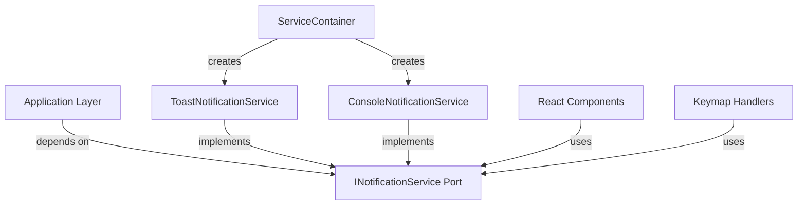

# 📋 Notification System Implementation Plan

**Date:** 2025-10-26  
**Status:** Planned  
**Owner:** Development Team  
**Priority:** High  

## 🎯 Objective
Implement a flexible, architecture-compliant Notification System that integrates with the existing Action Bus and Keymap systems, following DDD, Clean Architecture, and Hexagonal Architecture principles.

## 📚 Architecture Overview

### 1. Layer Responsibilities

| Layer | Component | Responsibility |
|-------|-----------|----------------|
| **Application** | `INotificationService` | Port (interface) defining notification capabilities |
| **Infrastructure** | `ToastNotificationService` | Adapter for web toast notifications |
| **Infrastructure** | `ConsoleNotificationService` | Adapter for development/testing |
| **Composition** | `ServiceContainer` | DI container setup |
| **Presentation** | `sonner` | Toast UI component |

### 2. Dependencies



## 📋 Implementation Phases

### Phase 1: Application Layer - Port Definition
- [ ] Create `src/application/ports/INotificationService.ts`
- [ ] Define notification methods (success, error, info, warning)
- [ ] Update `src/application/ports/index.ts`

### Phase 2: Infrastructure Layer - Adapters
- [ ] Create `ToastNotificationService.ts` (sonner implementation)
- [ ] Create `ConsoleNotificationService.ts` (for testing)
- [ ] Set up `index.ts` exports

### Phase 3: Composition Layer - DI Integration
- [ ] Add notification service to `ServiceContainer`
- [ ] Implement initialization and getter
- [ ] Add cleanup in `reset()`

### Phase 4: Keymap Integration
- [ ] Update `ActionContext` interface
- [ ] Modify keymap actions to use notifications
- [ ] Add notification feedback for key actions

### Phase 5: Presentation Layer - UI Components
- [ ] Install `sonner` package
- [ ] Add `Toaster` provider to root component
- [ ] Configure toast theming (Catppuccin colors)

### Phase 6: Testing & Verification
- [ ] Unit tests for all services
- [ ] Integration test with Action Bus
- [ ] Manual testing of all notification types
- [ ] Performance impact analysis

### Phase 7: Documentation
- [ ] Architecture decision record (ADR)
- [ ] Usage examples
- [ ] Integration guide

## 🎨 UI/UX Specifications

### Toast Notifications
- **Position**: Top-right
- **Duration**: 4s (success/info), 6s (error/warning)
- **Colors**: 
  - Success: Green
  - Error: Red
  - Info: Blue
  - Warning: Orange
- **Animation**: Slide-in from right, fade out
- **Accessibility**: ARIA labels, keyboard dismiss

## ⚙️ Configuration

### Environment Variables
```env
# NODE_ENV=development will use ConsoleNotificationService
NODE_ENV=production

# Optional: Disable notifications for tests
DISABLE_NOTIFICATIONS=false
```

## 📊 Success Metrics
- [ ] All notification types work in both dev and prod
- [ ] No console errors during notification display
- [ ] <50ms notification trigger time
- [ ] 100% test coverage of notification logic
- [ ] Documentation complete and up-to-date

## 🔄 Dependencies
- `sonner` - Toast notification library
- `@testing-library/react` - For testing
- `@types/jest` - TypeScript types for tests

## 🚀 Future Enhancements
1. **Rich Notifications**: Add icons, action buttons
2. **Persistence**: Show unread notifications
3. **User Preferences**: Allow customization of position/duration
4. **Analytics**: Track notification interactions
5. **Offline Support**: Queue notifications when offline

## ⚠️ Known Issues
- None currently identified

## 📅 Timeline
- Start: 2025-10-26
- Estimated Completion: 2025-10-27

## 👥 Team
- Lead Developer: [Your Name]
- UI/UX: [Designer Name]
- QA: [Tester Name]

---
*Last Updated: 2025-10-26*
